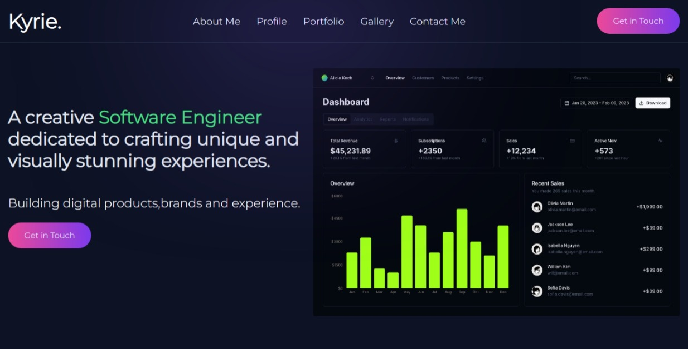

# My Portfolio Website 🚀



## Table of Contents

1. [About Us](#about-us) 📖
2. [Profile](#profile) 👤
3. [Portfolio](#portfolio) 💼
4. [Gallery](#gallery) 🖼️
5. [Contact Us](#contact-us) 📞

## About Us 📖

Welcome to my portfolio website! Here, you can learn more about my background, skills, and experiences.

## Profile 👤

A brief introduction to who I am, my personal profile, and what I do.

## Portfolio 💼

Showcasing my skills and experience through various projects.

## Gallery 🖼️

A collection of photos that highlight my work and achievements.

## Contact Us 📞

Feel free to reach out via email, Instagram, or phone.

| Method       | Contact Info                                                |
|--------------|-------------------------------------------------------------|
| **Email**    | [example@example.com](mailto:example@example.com)           |
| **Instagram**| [@example](https://instagram.com/example)                   |
| **Phone**    | +123 456 7890                                               |

---

### Example of Preserved Formatting

Here's an example of how to preserve formatting in Markdown:

```html
<!DOCTYPE html>
<html lang="en">
<head>
  <meta charset="UTF-8">
  <meta name="viewport" content="width=device-width, initial-scale=1.0">
  <title>Portfolio</title>
</head>
<body>
  <h1>Welcome to My Portfolio</h1>
</body>
</html>
```

